# 🥪 Sandwichy App

A simple and clean **food delivery** mobile app built using **Flutter**.  
It allows users to manage meals locally with a focus on smooth user experience and clean design. All data is handled offline without backend dependencies using **SQLite** and **SharedPreferences**.

---

## 📱 Features

- 🚀 Beautiful splash screen
- ➕ Add meals to your local menu
- ❌ Delete meals from the list
- 📝 Manage meals dynamically (locally stored)
- 💾 Offline data persistence (no backend)
- 🎨 Clean and user-friendly UI

---

## 🛠 Tech Stack

- **Flutter**
- **Dart**
- **SQLite (sqflite)** for structured local database
- **SharedPreferences** for simple key-value data

---

## 📦 Packages Used

| Package           | Purpose                        |
|-------------------|--------------------------------|
| `sqflite`         | Local database (SQLite)         |
| `shared_preferences` | Simple data persistence       |

---

## 🚀 How to Run

```bash
# 1. Clone the repository
git clone https://github.com/iahmedmostafa/sandwichy_app.git
cd sandwichy_app

# 2. Install dependencies
flutter pub get

# 3. Run the app
flutter run
```

📸 Screenshots:
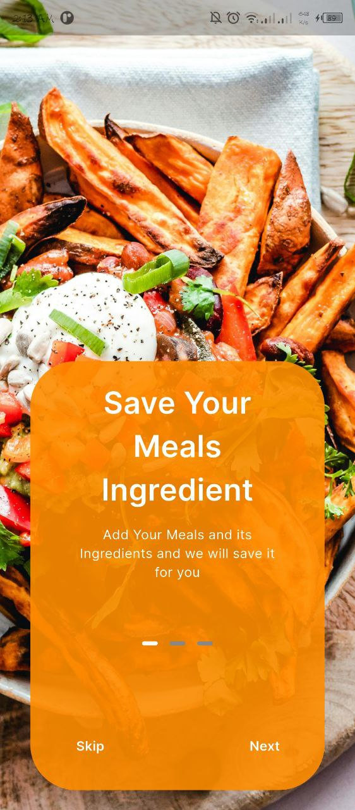
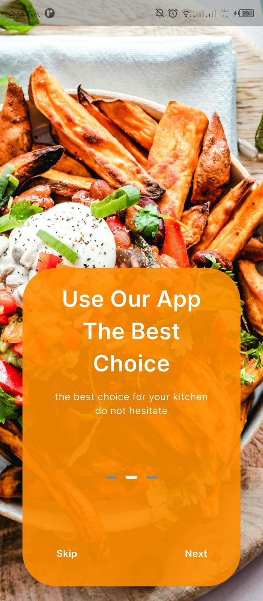
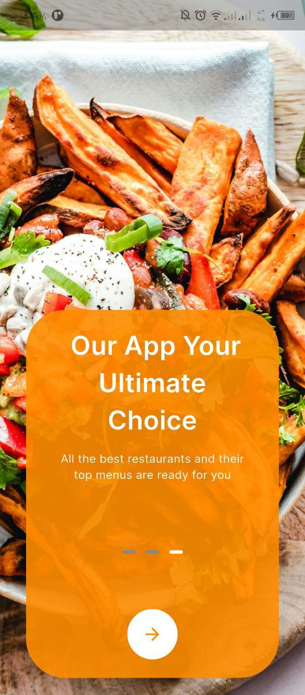
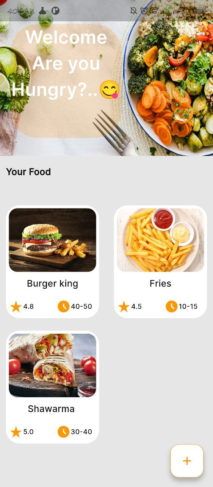
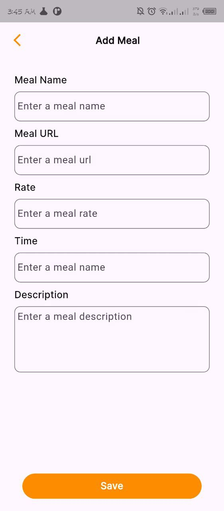
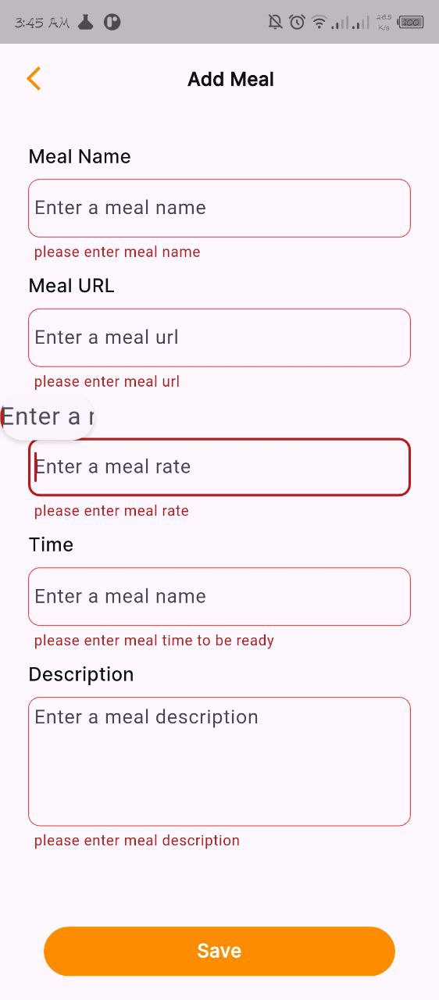
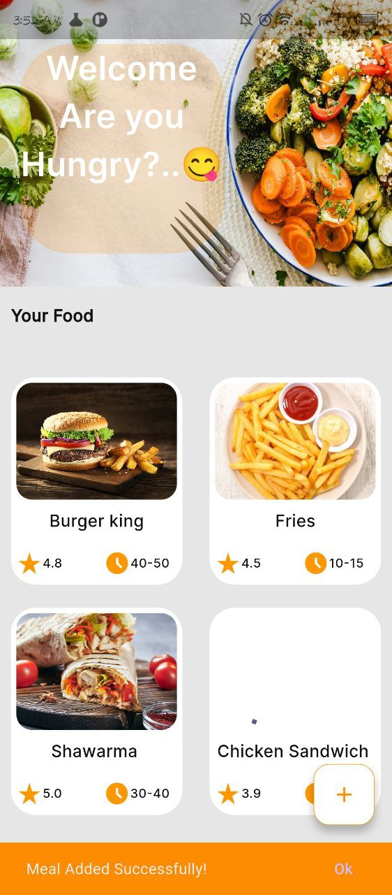
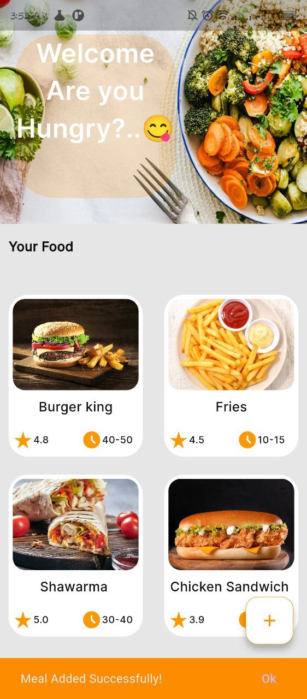
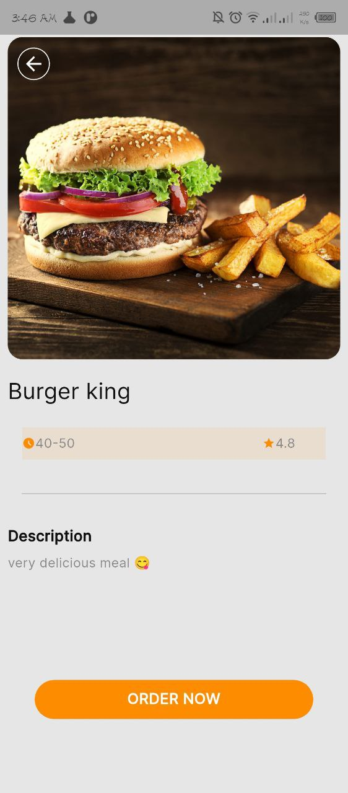
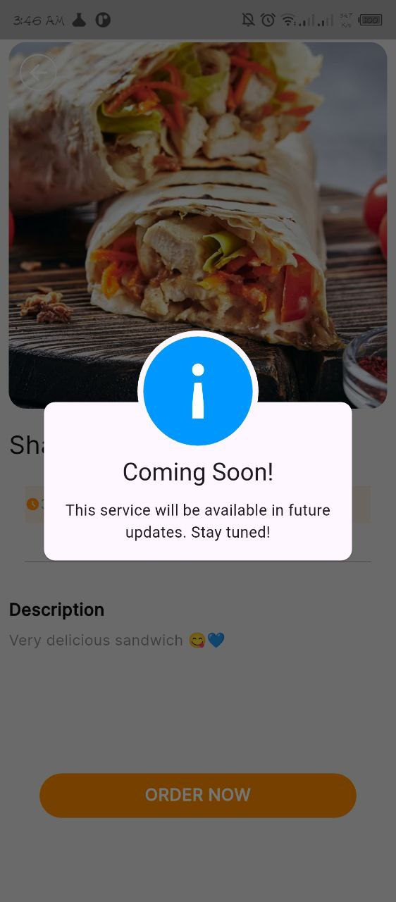
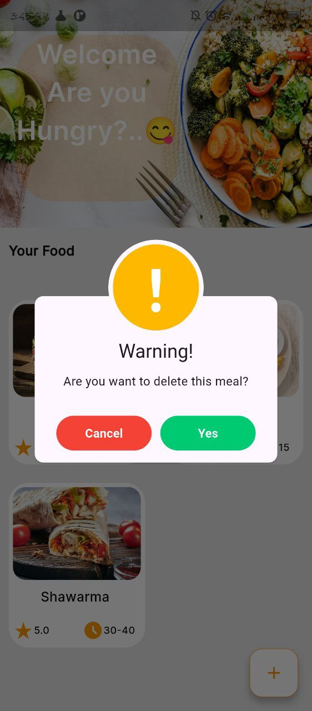


## License:
This project is licensed under the MIT License - see the LICENSE file for details.

## Developed by
Ahmed Mostafa
GitHub: [@iahmedmostafa](https://github.com/iahmedmostafa)

